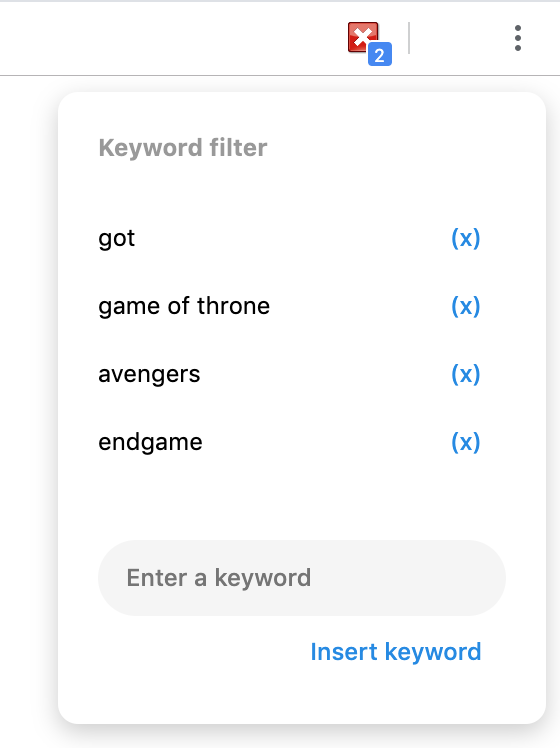

# No Spoiler - Chrome Extension

A Chrome browser extension that filter out (remove) all content that match with keywords.
Take back the control of what you want to see.

## Keywords Panel

## Result

## Install

1. Clone or [download and unzip this github repository](https://github.com/hieunc229/chrome-ext-nospoiler/archive/master.zip)
2. On Chrome browser, enter URL `chrome://extensions/` to manage extensions.
3. Install extension by choose `Load unpacked`, and navigate to this repository directory

## Usage

From keywords panel, add or remove keys that you don't want to appear on the webpage.
Any content, paragraph that matches with the keywords will automatically be transparent.
No more spoiler and unwanted content.